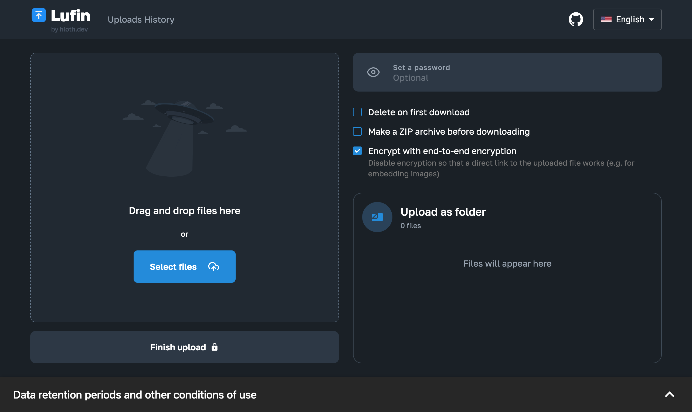

# Lufin — a modern filesharing service based on lufi



Lufin (Let’s Upload that File—Next) is a modern alternative to lufi.

Features:

- Modern neat design
- S3 storage support (with Cloudflare R2 compatability)
- Rich client-side preview features for: images, audio, video, zip archives, xlsx spreadsheets, text files, PDF
- Translated to 24 languages: English, Русский, Български, Čeština, Dansk, Nederlands, Eesti, Suomi, Français, Deutsch, Ελληνικά, Magyar, Italiano, Latviešu, Lietuvių, Norsk, Polski, Português, Română, Slovenčina, Slovenščina, Español, Svenska, Türkçe. See [TRANSLATION.md](./TRANSLATION.md) for more information on how to contibute support for a language.
- Metadata stripping such as EXIF from images
- Configurable data retention settings based on files size
- Optional end-to-end encryption using AES-GCM allowing user to opt-out to use files in hotlinks
- Password protection
- Delete at first downlaod
- Client-side archive generation before uploading
- Client-side image compression
- Automatic file renaming with option to keep original filenames
- Links to uploaded files are stored in LocalStorage
- Importable/exportable LocalStorage with a button to clean up expired pages

**This app requires JavaScript in order for client-side encryption to work.**

## Demo

Please keep in mind that this is a demo website — the filesize limit is very low, upload speed is limited and files are deleted after 10 minutes. It is only intended to demonstrate how this project works and not to store your files.

[lufin.hloth.dev](https://lufin.hloth.dev)

## Usage

Before starting, please ensure you understand and meet all of the requirements:

1. You are solely responsible for your server safety, for content posted through this service and how it’s used.
2. You know how web servers work and can setup nginx reverse proxy, let’s encrypt certificates or Cloudflare free SSL, as this is out of this guide’s scope
3. You will need a domain for this service. You can either use two domains (one for frontend and one for backend/subdomain) or a single domain with backend serving under a nested route, such as /api
4. You have [bun](https://bun.sh) installed — it’s a server JavaScript runtime, the language both frontend and backend are written in. Node.js won’t work, deno is not tested.
5. You have MongoDB installed, configured and ready to accept connections. Mongo Atlas will probably work although not tested. No need to create a database, collection or indexes, just obtain the connection string and ensure new collection can be created through it. Remember: you are solely responsible for your database security. Do not expose it to the internet, or, at the very least, create a user with a strong password. MongoDB configuration is out of this guide’s scope
6. You have a basic understanding of what S3 is and how it works. Basically it’s a programmatic interface for cloud file storage. The easiest and cheapest way to get your own S3-compatible cloud storage is Cloudflare R2, in my opinion. First 10 GB for free and no charge for egress traffic. Any other S3-compatible cloud provider will work too, although not tested. Only S3 is supported as of now. Obtain S3 credentials as you will need them in step 10. In Cloudflare R2 you can obtain those in R2 -> API -> Account Tokens

Follow these instructions to install lufin to your server:

1. Clone this repository to your server
2. Open frontend directory in terminal
3. Run `bun install`
4. Run `cp .env.example .env` and open .env file in your preferred code editor
5. Fill .env
   - `VITE_API_URL` must point to the **public url** of backend, no trailing slash
   - Optionally add `VITE_CONTACT_EMAIL` which will be shown on the website as a contact email address.
6. Run `bun run build`
   - this command will create a static build of the frontend and output it to `dist` directory
   - Each time you edit frontend/.env file you will need to run `bun run build` command
   - `dist` directory must be served to users statically
   - Do not serve the repository’s root, do not serve the frontend directory, only serve the `dist` directory created after build command
7. Go back to the repository’s root and open backend directory in terminal
8. Run `bun install`
9. Run `cp .env.example .env && chmod 600 .env` and open .env file in your preferred code editor
10. Edit .env
    - `MONGODB_CONNECTION_STRING` must have the mongodb connection string
    - `CORS_ORIGIN` is an optional setting, which, if set, restricts your API to your Lufin frontend only
      - If you keep it disabled, other people will be able to host their own frontends and visitors of their websites will be able to upload to your storage. If you want to enable CORS, you must point the `CORS_ORIGIN` to **public url** of your frontend, exactly like it is visible in address bar in browser: protocol, domain, port (if not standart)
      - **CORS does not prevent abusers from uploading files to your server!** It only prevents people hosting lufin on their own server from using your API. **Even with CORS_ORIGIN enabled anyone can still upload files from anywhere**. If you still have questions about what is CORS, please consult the internet.
    - S3\_ prefixed settings are self-explanatory and mandatory
    - `S3_BUCKET` must be exactly what you have named the bucket in your S3 cloud provider, it doesn’t have to be `lufin`, but it’s concise and good name for a bucket for this project
    - You can specify S3 region using `S3_REGION`
11. Run `cp data-retention.config.example.json data-retention.config.json` and open data-retention.config.json file in your preferred code editor
12. This file defines data retention settings for your lufin instance
    - `seconds` is maximum time the file up to `limit` megabytes (1000 \* 1000 bytes) can be stored on the server
    - In the example you’ve just copied, files up to 10 megabytes can be stored at most for 365 days, files up to 50 megabytes can be stored at most for 150 days, files up to 100 megabytes can be stored at most 50 days and files over 100 megabytes cannot be stored
    - Technically this limitation is not for files but for pages: users will have to comply with this limit applying to sum of files they’re uploading in one page. **These limits are only preventing users from uploading big files in one request, but anyone can create several pages and upload several big files**. You can change these settings as you like, you can use decimal numbers for limit field and integer numbers for seconds field
    - Although technically you’re not limited, I suggest you keeping max file size at 100 mb: currently chunking is not supported, so each file is uploaded in one piece, in one request, if it fails — it has to be reuploaded from the start. If you use Cloudflare, keep in mind that they have 100 MB file upload limit per request for free tier and up to 500 MB for enterprise tier
    - **You must configure your reverse proxy to accept large files**, otherwise it’ll respond with 413 HTTP status. Nginx has a default limit of 1 MB/request which is configurable via `client_max_body_size` setting.
13. Run `bun start` in the backend directory
    - You might want to setup a daemon of your choice, such as linux systemctl daemon, [pm2](https://pm2.io/) or something else. What’s important is that **backend must be running under the same user who created .env** because it contains secret S3 keys and should not be readable by other users
    - You should not run backend as root user or even as sudoer user. Ideally you should create a separate linux user for lufin and grant it access only to the lufin instance so that in case of security vulnerabilities it could not exploit your server
    - You can use `PORT` environment variable to control the http port which will be used to run backend
    - **You must allow websockets connections in your reverse proxy**. If you use nginx, remember to add Upgrade and Connection headers.
14. Now that you have frontend `dist` directory served statically on your domain and backend running over a reverse proxy, open your website and try uploading a file
    - If you get a connection error, inspect network tab with browser devtools, most common errors are:
      - Connection refused: you misconfigured VITE_API_URL in frontend .env file, it must point to public url, not localhost
      - Something about CORS: you misconfigured CORS_ORIGIN in backend .env file. You should be able to get rid of this error by simply commenting out this variable as it will set "\*" as the CORS header value
      - 413 Request Entity Too Large: your proxy limits size of the request, so look for something between your browser and lufin instance
      - Something about websockets connection: your proxy blocks websocket connections, check cloudflare, reverse proxy settings
      - Websockets timeout: I doubt anyone will get this, but in case you do, it probably means your server is very slowly uploading file to the S3 cloud, so you need to configure your reverse proxy not to drop websocket connection for idle
15. We’re not done yet! There is one more thing... someone needs to cleanup expired pages and remove old files — that’s what backend/src/jobs/cleanup-expired-pages.ts script does. You can run it anytime with `bun ./backend/src/jobs/cleanup-expired-pages.ts` (path must be relative to your terminal working directory)
    - But ideally you want to add it to crontasks with something like `0 * * * * /home/youruser/.bun/bin/bun --env-file=/var/www/lufin/backend/.env /var/www/lufin/backend/src/jobs/cleanup-expired-pages.ts` — this is just an example, you can change frequency from every hour to anything you like (hint: use [crontab.guru](https://crontab.guru/#0_*_*_*_*)), you need to adjust path to the bun executable (use `which bun`) and path to the cleanup-expired-pages script

_(Optional)_ you might want to compile backend into a binary file so that it runs faster and has smaller memory footprint. You should be able to do that by running the command below in backend subdirectory

```bash
bun build \
	--compile \
	--minify-whitespace \
	--minify-syntax \
	--target bun \
	--outfile server \
	./src/index.ts
```

And then run `./server` instead of `bun start`

## Nginx example configuration

For your reference, there is a [contrib/nginx.conf] config with recommended directives for lufin to work on a single domain behind a reverse proxy.

## Why not docker?

There is just nothing to dockerize. I could maybe put bun and mongodb together into one container and create one script that runs build command for frontend, but it's just not worth it. If you really want docker, you can run mongodb in it.

## Why there is no compiled releases/binaries?

Don’t trust strangers on the internet, compile it yourself. In 2025 it only takes one command to install bun.sh and another to run the typescript directly. Only 3 years ago you’d have to install at least 15 more tools to do the same task.

## Motivation

I was working on this project in August 2023 - October 2023 as a part of a larger platform for one of my clients. In late 2024 I had to leave working on them because the client was constantly harassing and threatening me. This is a cleaned up version of filesharing subproject that I made for them, originally built as a microfrontend for Next.js.

I made this project while I was working with React and Next.js as my primary web frameworks and MongoDB as my favorite database. Things have changed and now I strongly prefer Svelte over React and rarely use Mongo instead of PostgreSQL. First commits are deliberetly offset by exactly -22 months.

Before publishing this project I rewrote backend from Fastify to Elysia, migrated from Next.js to Vite, from Next router to React Router, from i18next to paraglide js, optimized build size and separated code to dynamic chunks.

## Stack

Vite, React, Material UI, SCSS modules, MongoDB, Elysia, Bun, Rollup

## License

[MIT](./LICENSE.md)

## Donate

[hloth.dev/donate](https://hloth.dev/donate)
